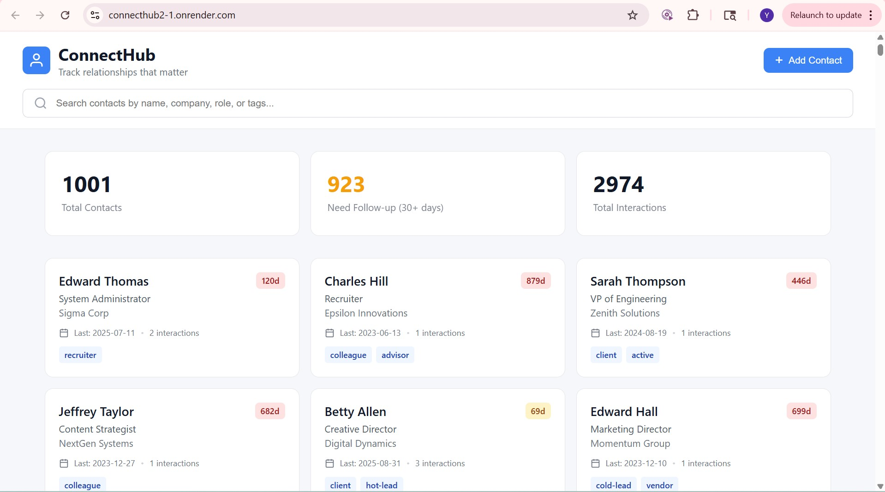

# ConnectHub - Professional Network Tracker



**Author:** Yizhang Cao  
**Class:** [CS5610 Web Development](https://johnguerra.co/classes/webDevelopment_fall_2024/)  
**License:** MIT

---

## Project Objective

ConnectHub is a full-stack MERN application that helps professionals, freelancers, and job seekers maintain meaningful relationships by tracking contacts and interactions. Unlike basic contact apps or LinkedIn, ConnectHub provides a private workspace for managing relationship details that actually matter—what you discussed, when to follow up, and how relationships develop over time.

---

## Live Demo

- **Frontend:** [https://connecthub2-frontend.onrender.com](https://connecthub2-frontend.onrender.com)
- **Backend API:** [https://connecthub2.onrender.com](https://connecthub2.onrender.com)

---

## Features

- **Contact Management**: Store contacts with name, email, company, role, and custom tags
- **Interaction Tracking**: Log meetings, calls, emails, and messages with notes and timestamps
- **Smart Insights**: See who needs follow-up based on days since last contact
- **Powerful Search**: Find contacts instantly by name, company, role, or tags
- **Full CRUD Operations**: Create, read, update, and delete contacts and interactions
- **Seeded Database**: 1000+ synthetic contacts with 2000-5000 interactions

---

## Design System

### Typography

ConnectHub uses a carefully selected typography pairing for optimal readability and visual hierarchy:

- **Headings:** Plus Jakarta Sans (Bold, Semi-bold)
- **Body Text:** DM Sans (Regular, Medium)

Both fonts are loaded from Google Fonts and provide excellent readability across all device sizes.

### Color Palette

The application uses a consistent color palette with CSS custom properties:

| Purpose | Color | Hex Code |
|---------|-------|----------|
| **Primary** | Blue | `#3b82f6` |
| **Primary Hover** | Dark Blue | `#2563eb` |
| **Success/Approve** | Green | `#10b981` |
| **Warning** | Amber | `#f59e0b` |
| **Danger/Cancel** | Red | `#ef4444` |
| **Text Primary** | Dark Gray | `#111827` |
| **Text Secondary** | Gray | `#6b7280` |
| **Background** | Light Gray | `#f9fafb` |

### Design Hierarchy

- **Visual hierarchy** follows F-pattern reading: most important elements (logo, search, add button) are positioned top-left
- **Consistent spacing** using an 8px base grid system
- **Clear visual feedback** for interactive elements (hover, focus, active states)
- **Semantic color usage**: Green for success/approval, Red for danger/cancel actions

---

## Accessibility Features

### Keyboard Navigation

- **Full keyboard support**: All interactive elements are accessible via Tab key
- **Focus indicators**: Clear visible focus states on all interactive elements
- **Skip link**: "Skip to main content" link for screen reader users
- **Escape key**: Closes modal dialogs

### ARIA Implementation

- Proper `role` attributes on semantic regions
- `aria-label` on buttons and interactive elements
- `aria-live` regions for dynamic content updates
- `aria-modal` and focus trapping for dialog components
- `aria-describedby` for form field hints

### Screen Reader Support

- Semantic HTML structure (`<header>`, `<main>`, `<article>`, `<section>`)
- Descriptive labels for all form inputs
- Screen reader-only text (`.sr-only`) for context
- Proper heading hierarchy (h1 → h2 → h3)

### Motion & Preferences

- Respects `prefers-reduced-motion` user preference
- Supports `prefers-contrast: high` for enhanced visibility

---

## Tech Stack

### Backend
- Node.js + Express
- MongoDB (native driver, no Mongoose)
- RESTful API architecture

### Frontend
- React 18 with Hooks
- PropTypes for type checking
- CSS Modules (component-based)
- CSS Custom Properties (design tokens)
- Fetch API (no axios)

### Deployment
- Render (backend & frontend)
- MongoDB Atlas (database)

---

## Installation Instructions

### Prerequisites
- Node.js (v14 or higher)
- MongoDB (v4.4 or higher)

### Setup

1. **Clone the repository**
```bash
git clone https://github.com/YizhangCao/connecthub2.git
cd connecthub2
```

2. **Install backend dependencies**
```bash
cd backend
npm install
```

3. **Install frontend dependencies**
```bash
cd ../frontend
npm install
```

4. **Configure environment variables**

Backend (`backend/.env`):
```
MONGODB_URI=mongodb://localhost:27017/connecthub
PORT=5000
NODE_ENV=development
```

Frontend (`frontend/.env.production`):
```
REACT_APP_API_URL=https://your-backend-url.onrender.com/api
```

5. **Seed the database**
```bash
cd backend
npm run seed
```

6. **Run the application**

Backend:
```bash
cd backend
npm run dev
```

Frontend (new terminal):
```bash
cd frontend
npm start
```

---

## Project Structure

```
connecthub2/
├── backend/
│   ├── config/
│   │   └── db.js              # Database connection
│   ├── models/
│   │   ├── Contact.js         # Contact model
│   │   └── Interaction.js     # Interaction model
│   ├── routes/
│   │   ├── contacts.js        # Contact API routes
│   │   └── interactions.js    # Interaction API routes
│   ├── scripts/
│   │   └── seedDatabase.js    # Database seeding script
│   ├── server.js              # Express server entry point
│   └── package.json
├── frontend/
│   ├── public/
│   │   └── index.html         # HTML template with fonts
│   ├── src/
│   │   ├── components/
│   │   │   ├── ContactCard.js/.css
│   │   │   ├── ContactDetail.js/.css
│   │   │   ├── ContactForm.js/.css
│   │   │   ├── Dashboard.js/.css
│   │   │   ├── InteractionForm.js/.css
│   │   │   ├── InteractionLog.js/.css
│   │   │   └── SearchBar.js/.css
│   │   ├── App.js             # Main application component
│   │   ├── App.css            # Application styles
│   │   ├── index.js           # React entry point
│   │   └── index.css          # Design system (CSS variables)
│   └── package.json
├── .eslintrc.json             # ESLint configuration
├── .prettierrc                # Prettier configuration
├── .gitignore
├── README.md
└── LICENSE                    # MIT License
```

---

## API Endpoints

### Contacts
| Method | Endpoint | Description |
|--------|----------|-------------|
| GET | `/api/contacts` | Get all contacts |
| GET | `/api/contacts?search=query` | Search contacts |
| GET | `/api/contacts/:id` | Get single contact |
| POST | `/api/contacts` | Create new contact |
| PUT | `/api/contacts/:id` | Update contact |
| DELETE | `/api/contacts/:id` | Delete contact |

### Interactions
| Method | Endpoint | Description |
|--------|----------|-------------|
| GET | `/api/interactions` | Get all interactions |
| GET | `/api/interactions/contact/:contactId` | Get interactions for contact |
| GET | `/api/interactions/:id` | Get single interaction |
| POST | `/api/interactions` | Create new interaction |
| PUT | `/api/interactions/:id` | Update interaction |
| DELETE | `/api/interactions/:id` | Delete interaction |

---

## React Components

| Component | Description | PropTypes |
|-----------|-------------|-----------|
| `App` | Main container, state management | - |
| `Dashboard` | Statistics display | contacts, apiUrl |
| `SearchBar` | Real-time search | value, onChange |
| `ContactCard` | Contact preview card | contact, onClick, onKeyDown, apiUrl |
| `ContactDetail` | Full contact view | contact, onBack, onDelete, apiUrl |
| `ContactForm` | Add contact modal | onSubmit, onCancel |
| `InteractionForm` | Log interaction modal | contactName, onSubmit, onCancel |
| `InteractionLog` | Single interaction display | interaction, onDelete |

---

## Usability Testing

A usability study was conducted with 3 participants. See the separate **Usability Study Report** document for detailed findings and recommendations.

---

## License

This project is licensed under the MIT License - see the [LICENSE](LICENSE) file for details.

---

## Acknowledgments

- Fonts: [Plus Jakarta Sans](https://fonts.google.com/specimen/Plus+Jakarta+Sans) & [DM Sans](https://fonts.google.com/specimen/DM+Sans) via Google Fonts
- Icons: Custom SVG icons
- Color palette inspired by Tailwind CSS
